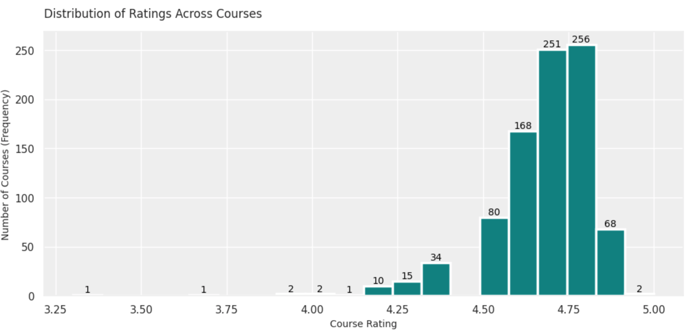
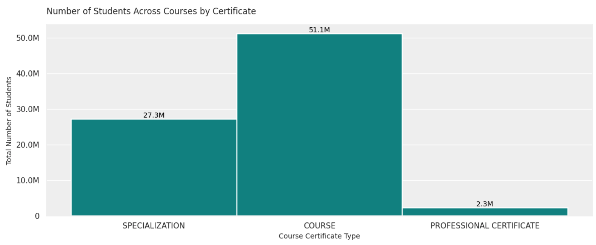
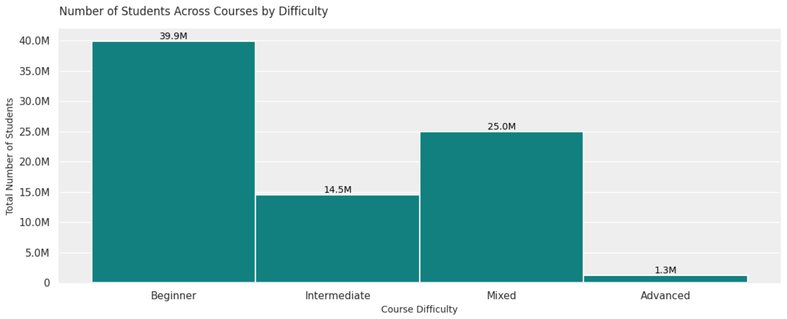
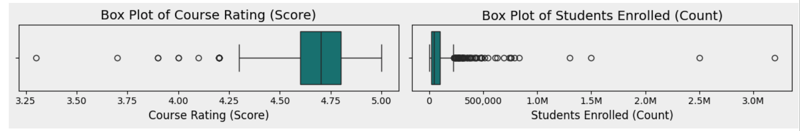
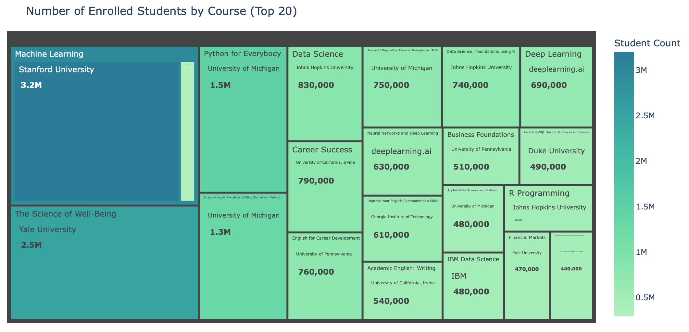
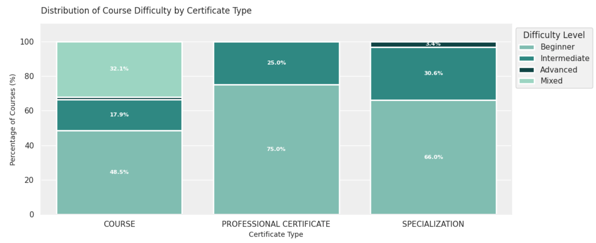
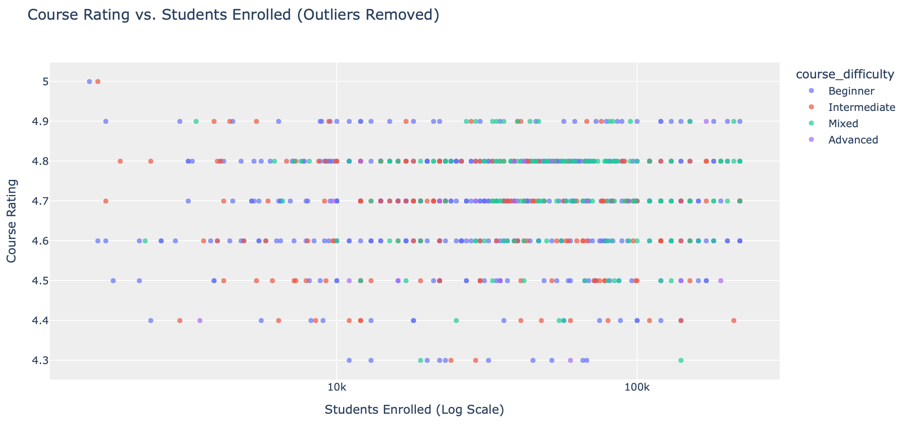

# 🎓 Coursera Courses Dataset EDA

This project features a comprehensive Exploratory Data Analysis (EDA) on a Coursera Courses dataset sourced from Kaggle. Leveraging Python, the analysis provides essential insights into the offerings from top global universities and organizations on the platform.
The dataset includes **~900 courses** from **150+ organizations**. The aim of this EDA is to extract valuable insights on courses' and organizations' popularity for for different stakeholders and suggest further investigation topics.

**Original dataset:** [Coursera Courses dataset](dataset/coursera_data.csv)

**Google Colab:** [Project in Google Colab environment](https://colab.research.google.com/drive/1kfDjHJl1l4UiKptEGTp-K0T79C7QO5te?usp=sharing)

**Jupyter Notebook file:** [Project saved as .ipynb in this repo](jupyter_notebook/Coursera_Analysis.ipynb)

## ⭐ Project Goals

**EDA Aim:** to explore the overall landscape of courses in the dataset and define the most popular courses, learning subjects and course organizations, and to form conclusions for stakeholders.

**Tasks:**
* **Initial Inspection:** to check the original dataset on any missing values or duplicates.
* **Data Manipulation:** to update data types and values in the dataset to perform statistical analysis.
* **Descriptive Statistics:** to aggregate data on courses and organizations popularity and to define distributions of values.
* **Hypothesis testing:** to perform correlation test to check with a rating of a course depends on course popularity (number of enrolled students) and vice versa.
* **Conclusions and recommendations:** to summarize insights into conclusions, define areas of further research, and formulate suggestions for stakeholders.

**Stakeholders:** `learners`, `course providers`, `online education researchers`.

## 🐍 Python libraries

The analysis was executed in Jupyter Notebook (Google Colab) using:
* **Mounting on Drive:** `google.colab`
* **Data Processing:** `pandas` and `numpy`
* **Data Visualization:** `matplotlib`, `seaborn`, and `plotly.express`

## 📊 Key Findings

Analysis delivered valuable insights into the course ecosystem:

### 💡 Quality & Provider Landscape
* **Scale:** The dataset includes **891 courses** provided by **154 organizations**.
* **Top Providers (by Course Count):** University of Pennsylvania (59), University of Michigan (41), Google Cloud (34), Duke University (28), and Johns Hopkins University (28).
* **High Quality:** A significant **22%** of organizations maintain very high average course rating of **4.8 or above**.

* **Rating Distribution:** Course ratings are spanning from 3.3 to 5.0, with the majority concentrated between **4.7 and 4.8**. Ratings below 4.3 are considered statistical outliers.

### 🧑‍🎓 Popularity & Enrollment

* **Top Enrollment:** The most popular format by student count is the **"Course"** certificate type and the **"Beginner"** difficulty level.

**Outliers in Rating and Student Enrollment columns:**

* While most courses enroll under **222.5k** students, there are **78 highly popular outliers**, including: *"Machine Learning"* (Stanford), *"The Science of Well-Being"* (Yale), and *"Python for Everybody"* (U. of Michigan).
* **Top Providers (Enrollment):** The most popular providers by total enrolled students are the *University of Michigan (7.4M)*, *University of Pennsylvania (5.5M)*, and *Stanford University (4.9M)*.
* **Trending Fields:** Popular study areas include programming (Python, R), machine learning, data science, English language, and career development.

### 🔗 Structure & Correlation

* **Course Types:** The courses are categorized into three certificate types ("Course," "Specialization," "Professional Certificate") and four difficulty levels. The **"Beginner"** difficulty level is the largest portion across all certificate types.
* **Difficulty vs. Rating:** Entry-level courses ("Mixed" and "Beginner") show a slightly higher average rating than more advanced courses.

* **Quality vs. Popularity:** A Spearman correlation test confirmed no statistically significant monotonic relationship between a course's rating and its student enrollment.

**Course popularity does not reliably predict its quality, and vice versa.**

## 📝 Conclusions & Suggestions

* Further analysis can be applied to selected course organizations or study fields to find valuable insights on the quality and popularity of particular courses within organizations or areas where new courses can be introduced to fill in the gaps in learning material.
* Course providers should prioritize content development exclusively within their key domain areas to ensure high-quality delivery, which directly impacts and helps maintain high average course ratings.
* Course organizations could invest into developing more "Intermediate" and "Advanced" level courses to attract more specified audiences or return students from "Beginner" level courses to continue their learning jouney with the organization.

## ⚙️ Setup & Reproducibility

The project is fully reproducible. To re-run the analysis, you must:
1.  Download the original dataset (`.csv` file) from the Kaggle link above or from this [repo](dataset/coursera_data.csv).
2.  Upload the file to your working environment (e.g., local directory or mounted Google Drive).
3.  Ensure the file path in the initial setup code cell is updated to correctly load the dataset.
   
